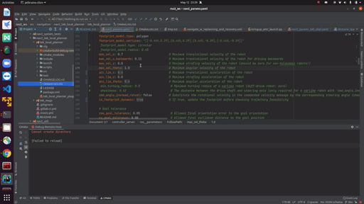

# clion_remote_debug
setup clion remote debug with ros2 and docker

# Docker setting

## 1. Install pkgs

```shell
sudo apt-get update \
  && sudo apt-get install -y ssh \
      build-essential \
      gcc \
      g++ \
      gdb \
      clang \
      cmake \
      rsync \
      tar \
      python
```

## 2. Add group and user


### 2.1 New group and user
Add new group and user (recommended)
```shell
groupadd -g 1011 test
useradd -m testuser -g test -G root
echo 'testuser:123' | chpasswd
```

### 2.2 Existed group and user
If existed group, need to change group authority and add a new user(better to ignore existed user):

(such as 'user' is the existed group, add new user 'sftpuser' to it)

```shell
useradd -m sftpuser -g user
echo 'sftpuser:123' | chpasswd
```

### 2.3 Modify group authority by sudoers file(Optional).

Firstly, open write authority of sudoers file:
```shell
chmod u+w /etc/sudoers
```

Secondly, add text "user    ALL=(ALL:ALL) ALL" into sudoers file
```shell
vim /etc/sudoers
```

Thirdly, close write authority of sudoers file:
```shell
chmod u+w /etc/sudoers
```

## 3. Modify sshd_config

Write the text below into /etc/ssh/sshd_config file

```text
Port 202
PasswordAuthentication yes
PermitEmptyPasswords no
PermitRootLogin yes
UsePAM no
Subsystem sftp internal-sftp
Match Group testuser
    ChrootDirectory /
    ForceCommand internal-sftp
    AllowTcpForwarding no
    X11Forwarding no
```

**Important !!!!!**

### 3.1 name
The name follow Match Group must be the name with the user you add, do not use group name.

### 3.2 port
The port must be the same with the docker you used.

## 4. Save change into docker

```shell
docker commit -a "shanph" -m "upgrade" 7c8c8fbb58eb shanph:test
```

The 7c8c8fbb58eb is check with:
```shell
docker ps -a
```

## 5. Run docker(port must be same with that in sshd_config file)

Whatever command you used to run docker, must have the option -p, such as:
```shell
docker run -d --cap-add sys_ptrace -p127.0.0.1:202:202 --name clion_remote_env clion/remote-cpp-env:0.5
```

or just as single option in run shell:
```shell
-p 202:202
```


# Clion setting

In short, you should add a new Toolchain entry in settings under Build, Execution, Deployment as a Remote Host type.

Then click in the Credentials section and fill out the SSH credentials we set-up in the Dockerfile (Host: localhost, Port: 2222, User name: user, Password: password).

Finally, add a CMake profile that uses this toolchain(remote). If you want more fine grained control over the paths used inside the container take a look at the Deployment settings page.


# ROS2 setting

Firstly, run docker, cd to your ros2 workspace, compile and source current ws:
```shell
cd ros2_ws
. /opt/ros/foxy/setup.bash
colcon build --symlink-install
. install/setup.bash
```

Then copy env.sh to your ros2 workspace(env.sh is provided in my project), get the environment param.
```shell
./env.sh
```

Copy the output to CLion -> CMake -> Environment.


Now, all is finished.


Enjoy yourself.


# Others

## 1. Can not find custom package

Such as the costmap_converter for teb. costmap_converter pkg is not installed because I want to use the custom version. But at the begin, cannot find it.

```text
Could not find a package configuration file provided by “costmap_converter” with any of the following names
```

**Solve by set pkg_DIR before find_package.**

```c++
set(costmap_converter_DIR /midea_robot/ros2_ws/build/costmap_converter)
```

Because colcon build is corrected. In build folder, there are **Config.cmake files. We can use the files to find the pkg.

## 2. Open colcon compile option to show which lib linked.

Use the command to show compile process.
```shell
colcon build --symlink-install --event-handlers console_direct+
```


# Solve 'cannot create directory' problem

<p align='center'>
    
</p>


# mp4 to gif

```shell
ffmpeg \
-i clion_remote_docker_debug-2021-05-12_23.29.07.mp4 \
-r 30 \
-vf "scale=512:-1,split[s0][s1];[s0]palettegen[p];[s1][p]paletteuse" \
-ss 00:00:00 -to 00:00:42 \
cannot_create_directory.gif
```


